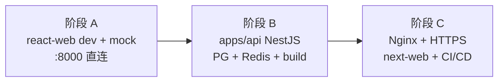

# personal-hub 完整部署计划

> 状态：权威总览（阶段 A 已落地；阶段 B/C 为规划）  
> 最后更新：2026-07-26  
> 适用：Ubuntu 24.04 / 2 核 4G / 个人远程阅读 → 后续 NestJS 全栈

**与其它文档关系：**

| 文档 | 角色 |
| --- | --- |
| **本文** | 总路线图、目录约定、Git 策略、阶段划分、迁移说明 |
| [pm2-deployment.md](./pm2-deployment.md) | 阶段 A PM2 实操与排障 |
| [server-deployment-guide.md](./server-deployment-guide.md) | 一页命令速查 |
| [personal-remote-reading.md](./personal-remote-reading.md) | 阶段 A/B 细节（mock、COS、缓存、API 改造） |
| [deployment.md](./deployment.md) | 长期生产（Docker Compose、Nginx、备份、CI/CD 模板） |

---

## 1. 部署目标与阶段



| 阶段 | 运行形态 | 后端 | 小册数据 | 你现在在哪 |
| --- | --- | --- | --- | --- |
| **A** | PM2 跑 `pnpm dev:react`（mock） | Umi mock | rsync → `/data/.../content-local` + `sync:booklets` | **已部署第一版** |
| **B** | PM2 API + Nginx 静态 `dist` | `apps/api` NestJS | COS 或继续本地目录 + API 按需读 | 未开始 |
| **C** | 多应用 + 域名 + 自动化发布 | NestJS 全模块 | COS 为主 | 长期 |

**原则：** 阶段 A 与 B/C **共用同一套服务器目录规范**；只增服务、不换盘位，避免以后迁 NestJS 时再搬数据。

---

## 2. 代码与数据：分开还是放同一项目下？

### 结论：**分开目录，代码里用软链接入（推荐，保持现状）**

| 类型 | 服务器路径 | 是否进 Git | 说明 |
| --- | --- | --- | --- |
| **代码** | `/opt/personal-hub/` | ✅ Gitee 管理 | Monorepo：`apps/react-web`、`packages/`；后续 `apps/api` |
| **小册源文件** | `/data/personal-hub/content-local/` | ❌ | 体积大、更新频；不进仓库 |
| **软链** | `/opt/personal-hub/content-local` → 上项 | — | 让 `sync:booklets` 脚本路径与本地一致 |
| **环境变量** | `/etc/personal-hub/.env` | ❌ | 密钥；软链到仓库根或 API 目录 |
| **运行时缓存** | `/var/cache/personal-hub/` | ❌ | 阶段 B 章节 LRU |
| **数据库/Redis 数据** | `/data/personal-hub/postgres/`、`redis/` | ❌ | 阶段 B Docker 卷 |
| **上传与备份** | `/data/personal-hub/uploads/`、`backups/` | ❌ | 阶段 B 起 |

### 为什么不把 data 塞进 `/opt/personal-hub/` 一个文件夹？

| 分开（当前） | 全塞进项目目录 |
| --- | --- |
| `git pull` / 重装代码盘不影响小册与数据库 | 容易误删、误提交、与 `node_modules` 混排 |
| 数据盘可单独扩容、快照、迁移实例 | 71 本小册与代码同盘，60GB 很快紧张 |
| 备份策略分离：代码=Git，数据=rsync/COS | 重装系统时要手工挑目录 |
| 与 Docker 卷、COS 长期方案一致 | 不符合 Linux FHS 常见实践（`/opt` 装软件，`/data` 存数据） |

**不要**在 `/opt/personal-hub/content-local/` 放实体小册目录；**只要软链**。

### 目录总览（阶段 A → B 共用）

```text
/opt/personal-hub/                    # Git 仓库（仅代码与配置脚本）
├── apps/
│   ├── react-web/                  # 阶段 A：Umi dev / 阶段 B：dist 静态
│   └── api/                        # 阶段 B 新增：NestJS
├── packages/shared-types/
├── ecosystem.config.js             # 阶段 A PM2 标准配置
├── ecosystem.prod.cjs              # 阶段 B 规划：api + 可选 web
├── content-local -> /data/personal-hub/content-local
└── .env -> /etc/personal-hub/.env  # 阶段 B

/data/personal-hub/
├── content-local/                  # 小册 Markdown（阶段 A rsync）
├── postgres/                       # 阶段 B
├── redis/                          # 阶段 B
├── uploads/                        # 阶段 B
└── backups/                        # 备份归档

/etc/personal-hub/.env              # 生产密钥（不进 Git）

/var/cache/personal-hub/chapters/   # 阶段 B API 磁盘缓存
```

---

## 3. 仓库与 Git 策略（GitHub + Gitee）

服务器无法稳定访问 GitHub 时，采用 **双远程、分工明确**：

| 环境 | 远程 | 用途 |
| --- | --- | --- |
| **本地开发机** | `origin` → GitHub | 日常开发、PR、备份 |
| **本地开发机** | `gitee` → Gitee | 推送到国内镜像 |
| **服务器** | 仅 Gitee | `git clone` / `git pull` |

当前仓库远程示例：

```text
origin  https://github.com/orangejava/personal-hub.git   # 本地
gitee   https://gitee.com/oralemon/personal-hub.git      # 本地 + 服务器
```

### 本地：推送到 Gitee（部署前）

```bash
# 在本地仓库根
git push gitee develop    # 或 main，与服务器跟踪分支一致
```

### 服务器：首次 clone（新机器或干净目录）

```bash
cd /opt
# 若已有手动上传的文件，先备份再清空，见 §5.2
git clone https://gitee.com/oralemon/personal-hub.git personal-hub
cd personal-hub
git checkout develop      # 与发布分支一致
pnpm install
```

### 服务器：日常更新代码

```bash
cd /opt/personal-hub
git pull
pnpm install              # lockfile 变更时
pnpm sync:booklets        # 仅小册目录有变时
pm2 restart personal-hub-dev
```

### Gitee 认证

- **HTTPS**：Gitee 私人令牌（Settings → 私人令牌），`git pull` 密码处填令牌  
- **SSH**（推荐）：服务器生成 SSH 公钥，添加到 Gitee 仓库部署公钥或账户 SSH 公钥  

```bash
# 服务器一次性
ssh-keygen -t ed25519 -C "server-personal-hub"
cat ~/.ssh/id_ed25519.pub   # 粘贴到 Gitee
git remote set-url origin git@gitee.com:oralemon/personal-hub.git
```

---

## 4. 当前 Monorepo 与部署相关代码

| 路径 | 阶段 A | 阶段 B（NestJS） |
| --- | --- | --- |
| `apps/react-web/` | Umi dev + mock，端口 **8000** | `pnpm build:react` → `dist/`，Nginx 托管 |
| `packages/shared-types/` | 前后端共享类型 | API DTO 与前端 service 契约 |
| `apps/api/` | **尚未创建** | NestJS + Prisma + PostgreSQL |
| `apps/next-web/` | 未创建 | 阶段 C SEO 页 |
| `ecosystem.config.js` | PM2 进程 `personal-hub-dev`；显式监听 `0.0.0.0:8000` | 阶段 A 继续使用或下线 |
| `apps/react-web/src/scripts/sync-local-booklets.ts` | 扫描 `content-local/` 生成 mock | 本地开发保留；生产改 API |
| `apps/react-web/src/scripts/sync-allowlist.json` | 白名单小册（约 12 本） | 上传 COS 时沿用目录名 |
| `content-local/`（本地） | gitignore，rsync 到服务器 | 本地 `booklet:push` → COS（规划） |

**阶段 A 限制（已知）：** Umi mock **仅 dev 生效**；`pnpm build` 后无 `/api/*`。个人阅读期用 dev 模式可接受；上 NestJS 前不要对公网宣传 build 版。

---

## 5. 阶段 A：完整部署流程

### 5.1 新服务器（空盘）

与 [personal-remote-reading.md §A](./personal-remote-reading.md#a-当前部署步骤dev--直连-8000) 一致，摘要：

1. 建目录：`/opt/personal-hub`、`/data/personal-hub/content-local`、`/var/cache/personal-hub`、`/etc/personal-hub`
2. 安装 Node 22、pnpm、PM2、git
3. `git clone` Gitee 到 `/opt/personal-hub`
4. 本机 rsync 白名单小册到 `/data/personal-hub/content-local/`
5. 软链 + `pnpm install` + `pnpm sync:booklets`
6. `pm2 start ecosystem.config.js --only personal-hub-dev` → 先验证服务器内 `:8000`，再配置公网安全组

速查命令见 [server-deployment-guide.md](./server-deployment-guide.md)。

### 5.2 从「第一版手动上传」迁移到 Gitee（你的现状）

若 `/opt/personal-hub` 已是 tar/scp 上传、**没有 `.git`**：

```bash
# 1. 备份现有代码（可选）
sudo cp -a /opt/personal-hub /opt/personal-hub.bak.$(date +%Y%m%d)

# 2. 保留数据盘（不要动）
ls /data/personal-hub/content-local

# 3. 清空代码目录后 clone（或 clone 到临时目录再替换）
cd /opt
sudo mv personal-hub personal-hub.old
sudo git clone https://gitee.com/oralemon/personal-hub.git personal-hub
sudo chown -R $USER:$USER /opt/personal-hub
cd /opt/personal-hub
git checkout develop
pnpm install

# 4. 恢复软链（数据仍在 /data）
ln -sfnT /data/personal-hub/content-local ./content-local
pnpm sync:booklets

# 5. 重启 PM2
pm2 delete ecosystem.dev 2>/dev/null || true
pm2 delete personal-hub-dev 2>/dev/null || true
pm2 start ecosystem.config.js --only personal-hub-dev
pm2 save
```

若已有 `.git` 但 remote 指向 GitHub：

```bash
cd /opt/personal-hub
git remote set-url origin https://gitee.com/oralemon/personal-hub.git
# 或 git remote add gitee ... && git pull gitee develop
git pull
pnpm install && pm2 restart personal-hub-dev
```

**小册无需重传**：只要 `/data/personal-hub/content-local` 未动，只做软链 + `sync:booklets`。

### 5.3 本机 → 服务器同步小册（仍不进 Git）

```bash
# 本地仓库根；白名单见 sync-allowlist.json
rsync -avz --progress \
  "./content-local/<小册目录名>" \
  用户@服务器IP:/data/personal-hub/content-local/
```

服务器：

```bash
cd /opt/personal-hub && pnpm sync:booklets && pm2 restart personal-hub-dev
```

### 5.4 验证清单（阶段 A）

| 检查 | 命令 / 地址 |
| --- | --- |
| 进程 | `pm2 status` → `personal-hub-dev` **online** |
| 端口 | `ss -lntp \| grep 8000` |
| HTTP | `curl -I http://127.0.0.1:8000` |
| 服务器路由 | `curl -I http://127.0.0.1:8000/content`、`/workspace/booklets` |
| 公网 | 安全组 TCP 8000 来源为客户端真实公网 IP `/32`；浏览器访问 `http://<公网 IP>:8000/content` |
| 小册 | 浏览器 `/content`、`/workspace/booklets` |
| 日志 | `pm2 logs personal-hub-dev --lines 50` |

### 5.5 阶段 A 公网访问边界

服务器内 `curl 127.0.0.1:8000` 验证的是应用与端口；公网访问还要经过腾讯云安全组。安全组“来源”填写的是访问设备的公网出口 IP，不是服务器公网 IP，也不是 Mac 的 `192.168.x.x` 局域网地址。

- `客户端公网 IP/32`：只允许一个公网出口，个人使用推荐。
- `0.0.0.0/0`：匹配全部 IPv4；只能用于短时确认安全组是否为阻塞点。
- 若只有 `0.0.0.0/0` 能访问，说明原 `/32` 与实际出口不一致，常见原因是动态宽带、手机热点、VPN 或代理。
- UFW 显示 `inactive` 只说明 Ubuntu UFW 未拦截，不能替代云安全组检查。
- 当前服务是 dev + mock，未配置 HTTPS，公网地址必须使用 `http://`。

需要确认真实来源时，临时开放后在服务器抓包：

```bash
sudo tcpdump -ni any -c 10 'tcp dst port 8000'
```

浏览器刷新一次，从输出左侧源地址确认公网出口，然后立即把安全组收紧到该地址 `/32`。

---

## 6. 阶段 B：接入 `apps/api`（NestJS）时的部署变化

> 代码尚未创建；以下为目录与服务 **增量**，不要求搬迁阶段 A 数据。

### 6.1 新增组件

| 组件 | 部署方式 | 端口 / 路径 |
| --- | --- | --- |
| `apps/api` | PM2 `personal-hub-api` | `127.0.0.1:3001` |
| PostgreSQL 16 | Docker，`/data/personal-hub/postgres` | `5432` 仅本机 |
| Redis 7 | Docker，`/data/personal-hub/redis` | `6379` 仅本机 |
| react-web | `pnpm build:react` + Nginx 静态 | `/` |
| Nginx | 反代 `/api` → NestJS | `80/443` |

### 6.2 请求链路（目标）

```text
浏览器 → Nginx :443
           ├── /        → apps/react-web/dist（静态）
           └── /api/*   → apps/api :3001 → PG / Redis / COS / 磁盘缓存
```

### 6.3 环境变量（`/etc/personal-hub/.env`）

见 [personal-remote-reading.md §6.5](./personal-remote-reading.md#65-配置环境变量) 与 [deployment.md](./deployment.md#环境变量管理)。

### 6.4 阶段 B 首次上线顺序

1. 仓库新增 `apps/api`、`docker-compose.yml`（仅 postgres + redis）
2. 服务器 `git pull` → `pnpm install`
3. `docker compose up -d postgres redis`
4. `pnpm --filter api exec prisma migrate deploy`
5. `pnpm --filter api build` && `pnpm build:react`
6. PM2 启动 API；Nginx 切静态 + 反代
7. 小册：COS `booklet:push` + `POST /admin/booklets/sync`（或过渡期继续 rsync + 本地目录适配层）

### 6.5 阶段 A → B 切换注意

| 项 | 处理 |
| --- | --- |
| `personal-hub-dev`（dev mock） | 切 B 后停止，改 Nginx 托管 dist |
| `/data/personal-hub/content-local` | 可保留作备份；生产正文以 COS 为准 |
| mock 账号 | 换 NestJS JWT / 登录 |
| 安全组 | 关闭公网 8000，只开 80/443 |

---

## 7. 阶段 C：长期生产（摘要）

与 [deployment.md](./deployment.md) 对齐：

- `apps/next-web` SEO 页逐步上线
- 域名 + Let's Encrypt
- 可选 Gitee Webhook / Gitee Go → SSH 执行 `git pull && build && pm2 reload`
- PostgreSQL / 文件备份到 COS
- Flutter App 共用同一 `apps/api`

---

## 8. 日常运维速查

| 场景 | 操作 |
| --- | --- |
| 只改前端/脚本 | 本地 push Gitee → 服务器 `git pull && pnpm install && pm2 restart personal-hub-dev` |
| 只改小册 | 本地 rsync → 服务器 `pnpm sync:booklets && pm2 restart personal-hub-dev` |
| 阶段 B 改 API | `git pull` → migrate → `pnpm --filter api build` → `pm2 restart personal-hub-api` |
| 看日志 | `pm2 logs` |
| 磁盘 | `du -sh /data/personal-hub/* /var/cache/personal-hub` |

---

## 9. 相关文档

- [server-deployment-guide.md](./server-deployment-guide.md) — 命令一页纸  
- [personal-remote-reading.md](./personal-remote-reading.md) — mock/COS/缓存/API 改造细节  
- [deployment.md](./deployment.md) — Docker、Nginx、备份、CI/CD 模板  
- [../foundation/architecture.md](../foundation/architecture.md) — 多应用架构  
- [../backend/api.md](../backend/api.md) — NestJS 接口契约  
