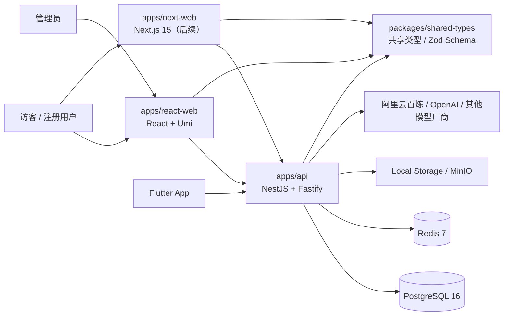
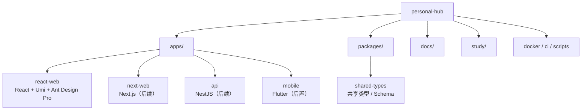
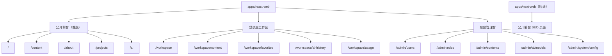
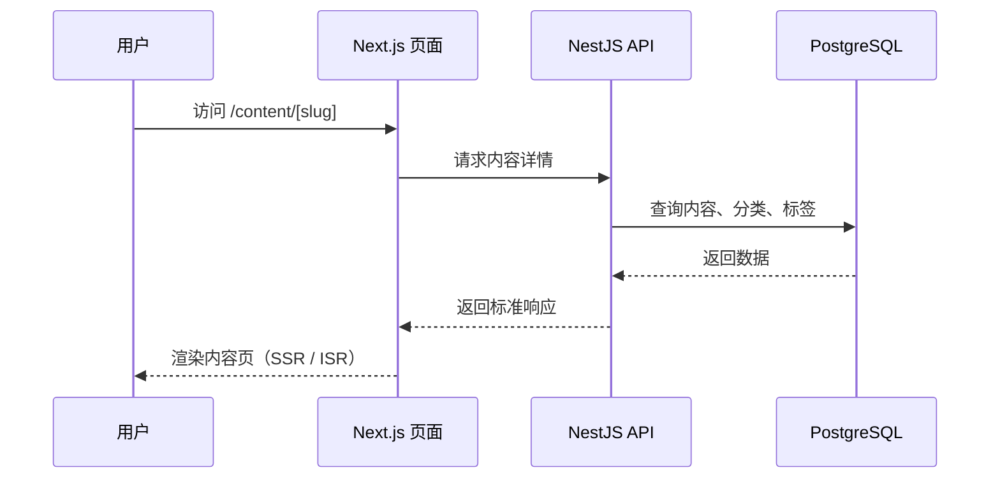
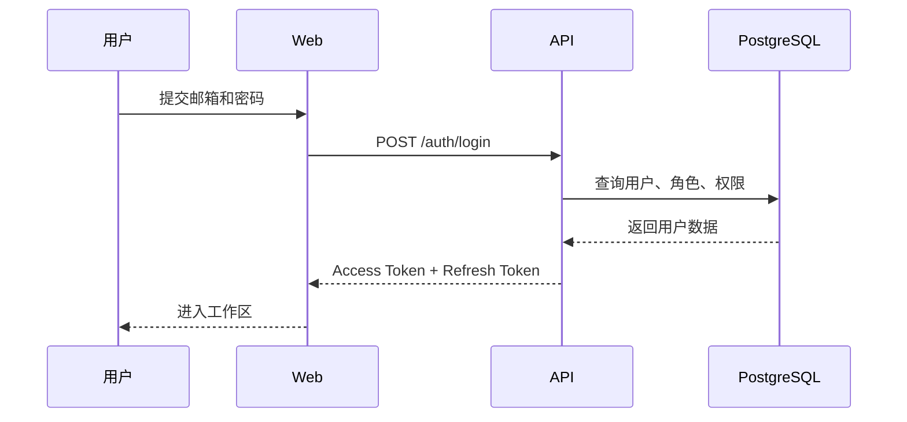
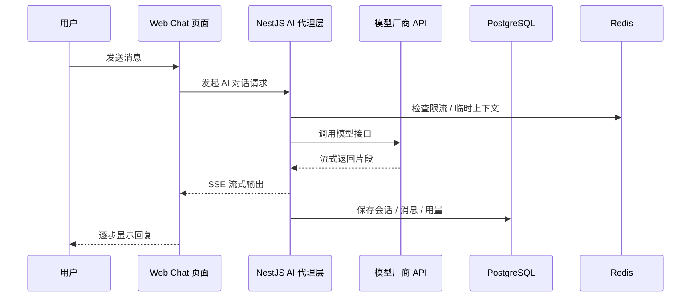
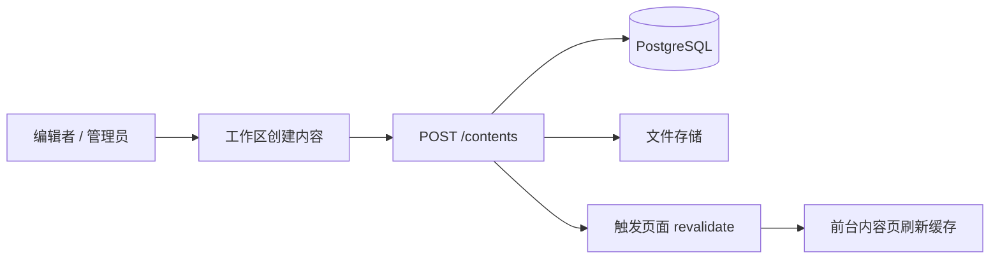
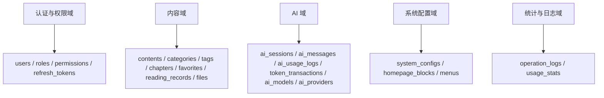
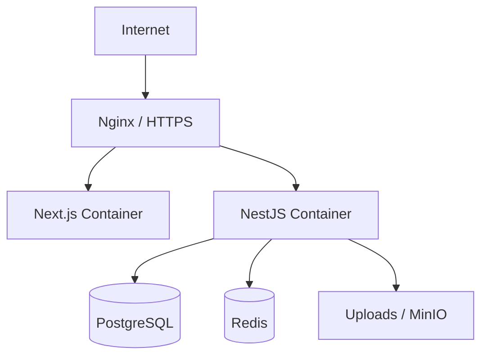

# 项目架构图与链路说明

> 目标：把“系统有哪些部分、它们如何协作、请求是怎么走的”讲清楚，方便从前端视角转向全栈视角。
> 最后更新：2026-06-27

---

## 1. 先用一句话理解整体架构

这个项目不是“一个前端站点”，而是一套完整系统：

- 当前阶段 `apps/react-web` 先用 React / Umi / Ant Design Pro 负责首版公开前台、登录后工作区、后台管理台
- 后续 `apps/next-web` 承担首页、内容中心、阅读页、项目页、关于我等适合 SEO 的页面
- 后续 `apps/api` 负责认证、内容、AI、管理能力
- `PostgreSQL` 负责核心业务数据
- `Redis` 负责缓存、限流、会话辅助
- `Local Storage / MinIO` 负责文件
- `AI 厂商` 负责模型推理能力

---

## 2. 系统上下文图

React-first 阶段后端未完成前，`apps/react-web` 先通过 Umi mock / 本地 service 模拟 API，mock 结构要尽量贴近后续 NestJS API。

---

## 3. 工程结构图

---

## 4. Web 端信息架构

说明：

- React-first 首版先完整跑通功能和交互
- 后续公开前台优先考虑 SEO、SSR、ISR，逐步迁移到 Next.js
- 工作区优先考虑交互效率和登录态
- 后台优先考虑表格、表单、权限和配置效率

---

## 5. API 模块关系图

```mermaid
flowchart TD
    App["AppModule"]
    App --> Auth["AuthModule"]
    App --> User["UserModule"]
    App --> Role["RoleModule"]
    App --> Permission["PermissionModule"]
    App --> Content["ContentModule"]
    App --> Category["CategoryModule"]
    App --> Tag["TagModule"]
    App --> Favorite["FavoriteModule"]
    App --> Reading["ReadingModule"]
    App --> File["FileModule"]
    App --> AI["AiModule"]
    App --> AISession["AiSessionModule"]
    App --> AIUsage["AiUsageModule"]
    App --> System["SystemModule"]
    App --> Homepage["HomepageModule"]
    App --> Admin["AdminModule"]
    App --> Log["LogModule"]
    App --> Prisma["PrismaModule"]

    Auth --> Prisma
    User --> Prisma
    Role --> Prisma
    Permission --> Prisma
    Content --> Prisma
    Category --> Prisma
    Tag --> Prisma
    Favorite --> Prisma
    Reading --> Prisma
    AI --> Prisma
    AISession --> Prisma
    AIUsage --> Prisma
    Admin --> Prisma
```

说明：

- `PrismaModule` 是大多数业务模块的底层数据访问依赖
- `AuthModule` 是权限体系入口
- `AiModule` 负责对外模型代理，不直接暴露厂商 Key 给前端

---

## 6. 请求链路图：普通内容页面

这条链路的学习重点：

- 前端不再只是“浏览器里请求接口”，而是 Next.js 服务端也参与渲染
- 内容页优先用 Server Component，因为 SEO 和首屏更重要

---

## 7. 请求链路图：登录认证

说明：

- Access Token 负责短时访问
- Refresh Token 负责续期
- 真正的权限校验在后端 Guard，不在前端按钮显隐

---

## 8. 请求链路图：AI 对话

这条链路的价值：

- 你会第一次真正接触“流式响应”
- 你会知道为什么 AI 系统需要会话表、消息表、用量表分离

---

## 9. 内容发布链路

说明：

- 内容系统不是“只写数据库”，还涉及发布状态、文件、缓存刷新
- 这也是你从前端转向全栈时要重点建立的新意识

---

## 10. 数据域划分图

---

## 11. 部署拓扑图

---

## 12. 作为前端开发者，你要重点理解哪些架构变化

### 从 React SPA 到 Next.js

- 不再只有浏览器端渲染
- 页面可以在服务端取数和渲染
- 组件要区分 Server Component 和 Client Component

### 从“调别人接口”到“自己设计接口”

- 你要开始关心 DTO、数据库字段、分页协议、错误码
- 你写的前端页面会反过来约束后端接口设计

### 从“一个前端项目”到“一个系统”

- 要考虑部署
- 要考虑鉴权
- 要考虑缓存
- 要考虑日志
- 要考虑回滚

---

## 13. 你后面画图时可以优先画哪几类图

如果以后你自己设计系统，优先从这几类图开始：

1. 系统上下文图：谁在用系统，系统依赖谁
2. 工程结构图：仓库里有哪些项目和共享包
3. 请求链路图：某个关键功能从前端到数据库怎么走
4. 数据域划分图：有哪些核心业务对象
5. 部署拓扑图：上线后服务放在哪里

> 画图不是为了“好看”，而是为了让你不再只盯着页面和接口，而是能看到整个系统。
