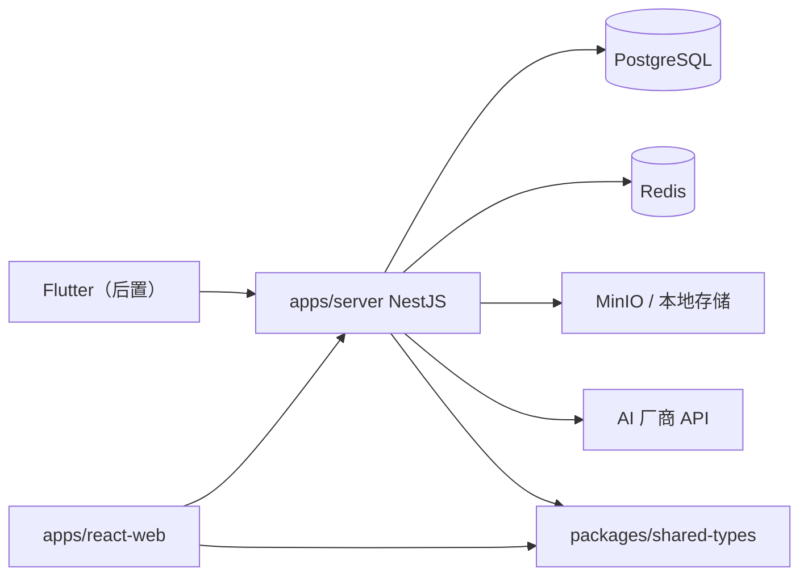

# NestJS 后端整体架构（确认稿）

> 状态：🟢 架构确认，待工程落地  
> 最后更新：2026-08-01  
> 关联：[architecture.md](./architecture.md)、[../backend/database.md](../backend/database.md)、[../backend/api.md](../backend/api.md)

> **命名**：后端应用目录为 **`apps/server`**（全端共用，不用 `apps/api`）。HTTP 路径仍为 `/api/*`。

---

## 1. 目标与边界

Personal Hub 进入 **阶段 6：接入 NestJS**。本文供 `apps/server` 脚手架与模块开发对齐。

**已确认的技术选型：**

| 项 | 选型 |
| --- | --- |
| 应用目录 | **`apps/server`**（NestJS，Web / 未来 Flutter 等共用） |
| 运行时 | NestJS 11 + **Fastify** 适配器 |
| 数据库 | **PostgreSQL 16** |
| ORM | **Prisma**，Schema 位于 **`apps/server/prisma/`** |
| 缓存 | **Redis 7**（热点读、限流、Refresh 黑名单可选） |
| 认证 | **JWT** Access **8h** + Refresh 7d；Refresh **响应体返前端**存本地 |
| 文件 / 小册 | MinIO 或本地卷；大文件 **分块上传** |
| 部署 | **Docker Compose**（server + postgres + redis + minio） |
| API 契约 | REST `/api/*`，`ApiResponse<T>`，与 mock 对齐 |

**本期不做（后置）：**

- Meilisearch 全文检索
- AI 厂商全量接入（先 SSE mock）
- Flutter 客户端
- Kubernetes 多副本

---

## 2. Monorepo 落位

```text
personal-hub/
├── apps/
│   ├── react-web/              # Umi 前端
│   └── server/                 # NestJS 全项目共用后端
│       ├── src/
│       │   ├── main.ts
│       │   ├── app.module.ts
│       │   ├── common/
│       │   ├── config/
│       │   └── modules/        # auth, user, content, booklet, file, ai…
│       └── prisma/
│           ├── schema.prisma
│           └── migrations/
├── packages/shared-types/
├── docker/
│   ├── docker-compose.yml
│   └── server/Dockerfile
└── docs/foundation/nest-backend-architecture.md
```

**Prisma 不放仓库根**：首版仅 `apps/server` 使用；若日后抽 `packages/database` 再迁移。

---

## 3. 系统上下文



---

## 4. 分层与模块职责

| 层级 | 职责 |
| --- | --- |
| Controller | 路由、DTO、鉴权装饰器 |
| Service | 业务、事务、缓存 |
| Prisma | 数据访问 |
| Guard | JWT + RBAC 权限码 |
| Interceptor | 统一 `ApiResponse` |

**落地顺序：**

1. Auth + User  
2. System（公开配置）  
3. Content + Booklet  
4. File（分块上传）  
5. Favorite + Reading  
6. Admin 子集  
7. Ai（SSE）

---

## 5. 认证：JWT（已确认）

### 5.1 Token 模型

| Token | 有效期 | 存储 | 用途 |
| --- | --- | --- | --- |
| Access Token | **8h** | 前端 sessionStorage / 内存 | `Authorization: Bearer` |
| Refresh Token | 7d | **响应体 → 前端 localStorage**（或现有 auth model 键） | `POST /api/auth/refresh` |

**不采用** HttpOnly Cookie 存 Refresh（首版与 react-web mock 存取方式一致，减少跨域/Cookie 复杂度）。

### 5.2 登录响应

```json
{
  "code": 0,
  "data": {
    "accessToken": "...",
    "refreshToken": "...",
    "expiresIn": 28800,
    "user": { "id", "nickname", "role", "permissions": [] }
  }
}
```

### 5.3 前端（react-web）

- 401 且 refresh 有效 → 调 `/api/auth/refresh` → 更新双 Token → 重试原请求  
- 登出：清本地 Token；可选服务端 Redis 黑名单 refresh  

### 5.4 环境变量

```env
JWT_ACCESS_SECRET=
JWT_ACCESS_EXPIRES=8h
JWT_REFRESH_SECRET=
JWT_REFRESH_EXPIRES=7d
```

---

## 6. Redis 缓存

| Key | 用途 | TTL |
| --- | --- | --- |
| `cache:system:public-config` | 公开配置 | 5 min |
| `cache:content:list:{hash}` | 列表 | 1 min |
| `cache:booklet:{id}:chapters` | 章节列表（无 body） | 10 min |
| `cache:booklet:chapter:{id}` | 单章正文 | 30 min |
| `ratelimit:{ip}:{route}` | 登录/AI | 滑动窗口 |
| `bl:refresh:{jti}` | 登出黑名单 | 动态 |

---

## 7. 小册 API

章节列表**不含 body**；单章接口含 body（修正当前 mock 过重问题）。

小册正文：小于约 256KB 可 PostgreSQL `TEXT`；更大走 MinIO。`content-local/` 导入脚本批量写入。

---

## 8. 分块上传

`POST /files/uploads/init` → `PUT .../parts/:n` → `POST .../complete`；小册 ZIP import 可走 uploadId。

详见原文档 §8 流程图；实现阶段同步更新 `docs/backend/api.md`。

---

## 9. Docker Compose

```yaml
services:
  server:
    build: ../apps/server
    ports: ["3000:3000"]
    depends_on: [postgres, redis, minio]
  postgres:
    image: postgres:16-alpine
  redis:
    image: redis:7-alpine
  minio:
    image: minio/minio
```

阶段 A（当前）：`dev:react` + mock + `sync:booklets`。  
阶段 B：Docker server + 前端 `API_BASE_URL` 切换。

---

## 10. 与 react-web 对接

- `API_BASE_URL=http://localhost:3000`  
- Service 方法名不变，只换 baseURL  
- Mock 保留作开发兜底  

---

## 11. 实施阶段（无工期承诺）

| 阶段 | 交付 |
| --- | --- |
| 1 | `apps/server` 脚手架、Docker、Prisma migrate、Health |
| 2 | Auth（8h + Refresh 返前端）、System、Redis |
| 3 | Content/Booklet API + 缓存 |
| 4 | 分块上传 + import + 前端切 API |
| 5 | Admin / AI SSE |

---

## 12. 已确认 vs 仍开放

| 项 | 状态 |
| --- | --- |
| 目录名 `apps/server` | ✅ 已确认 |
| Prisma 在 `apps/server/prisma` | ✅ 已确认 |
| Access 8h、Refresh 返前端 | ✅ 已确认 |
| 跳过 Next API Bridge，直接 Nest | ✅ 已确认 |
| 小册正文 >100KB 走 MinIO | 🟡 实现时按章节体积切 |
| Refresh 黑名单是否强制 Redis | 🟡 首版可仅 DB 撤销 |

---

## 13. 参考

- [NestJS 学习手册](../../study/nestjs-learning-handbook.md)
- [Prisma + PostgreSQL 学习手册](../../study/prisma-postgres-learning-handbook.md)
- [部署计划](../deploy/deployment-plan.md)
