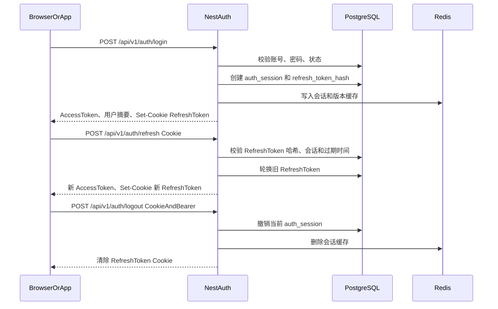

# Auth、会话与 RBAC 后端需求确认稿

> 状态：🟢 已确认；端点、响应与数据模型以 Canonical 文档为准
> 最后更新：2026-08-02
> 适用：`apps/server`（NestJS + Express）、`apps/react-web` 与未来 Flutter / 其它业务服务
> 关联：[用户、登录与权限体系](../../product/auth-rbac.md)、[Canonical API](../../backend/canonical-api.md)、[Canonical 数据模型](../../backend/canonical-data-model.md)

---

## 1. 目的与边界

本文件是 NestJS 编码前的认证、会话和授权基线，不沿用 React mock 的临时实现作为真实接口约束。

首版目标：

- 邮箱密码注册、验证、登录、登出、刷新登录态、找回密码、邮箱变更与个人资料读取。
- Access JWT 有效期 8 小时，Refresh Token 有效期 7 天。
- 多设备会话查看；用户可退出单个设备；管理员可踢单设备或全设备。
- 角色、权限、菜单配置、接口动作权限、资源数据范围均由服务端强制校验。
- 支持未来 Flutter 和其它服务共用身份体系，但本期仍是单体 Nest 应用，不提前拆 Auth 微服务。

本期不实现：

- GitHub / 微信等 OAuth 登录，以及 OAuth 外部身份绑定表。
- 团队实体、团队成员、团队邀请和实际 `team` 数据过滤。
- 全角色强制 MFA、第三方行为验证码和独立身份中心。

---

## 2. 现状与必须修正的 mock 差异

| 当前 mock / 前端行为         | 真实后端设计                                                                    |
| ---------------------------- | ------------------------------------------------------------------------------- |
| `mock-token-{role}` 可被伪造 | JWT 必须由服务端签名，Guard 验签、校验会话状态与认证版本                        |
| Token 存于 `localStorage`    | Access Token 仅存内存；Refresh Token 放 `HttpOnly` Cookie                       |
| 单一 `user.role`             | 首版仍为单角色；未来多角色通过 `user_role_assignments` 迁移，不提前实现空转模型 |
| 前端按菜单和按钮显隐         | 前端仅改善体验；所有 API 均执行服务端权限与数据范围校验                         |
| 只有 mock 登出               | 登出须撤销当前会话；支持指定会话、全量会话撤销                                  |
| 没有反爆破机制               | 账号 + IP 分层限流；连续 3 次失败后，下一次登录必须完成一次性自建验证码         |
| 没有二次验证                 | `admin` / `super_admin` 可自愿绑定 TOTP；未绑定时不强制                         |
| 启动时分开获取用户和权限菜单 | 可保留两个查询，但身份、权限和菜单均来自真实会话与授权数据                      |

当前 mock 路径和方法只是迁移线索，后续以本文件和 `docs/backend/canonical-api.md` 的最终契约为准。

---

## 3. 认证与 Token 策略

### 3.1 Token 分工

| 项         | Access Token                                     | Refresh Token                     |
| ---------- | ------------------------------------------------ | --------------------------------- |
| 格式       | JWT                                              | 高熵随机字符串                    |
| 生命周期   | 8 小时                                           | 7 天                              |
| 传递       | `Authorization: Bearer <token>`                  | 浏览器自动携带 `HttpOnly` Cookie  |
| 前端存放   | 仅内存状态，不写入 localStorage / sessionStorage | JavaScript 不可读取               |
| 用途       | 调用受保护 API                                   | 换取新 Access Token、注销当前会话 |
| 服务端存储 | 不存 JWT 原文                                    | 仅存 Token 哈希，绑定会话         |

选择 8 小时 Access Token 的代价是泄露窗口更长。因此必须配合 Redis 会话状态/版本校验；只依赖 JWT `exp` 时，强制下线最多要等待 8 小时。

### 3.2 JWT Claims

Access JWT 最小 Claims：

```json
{
  "sub": "user_id",
  "sid": "session_id",
  "av": 3,
  "pv": 12,
  "iat": 0,
  "exp": 0
}
```

- `sub`：用户 ID。
- `sid`：当前设备会话 ID。
- `av`：用户认证版本。全设备下线、禁用账号、修改密码时递增。
- `pv`：权限版本。角色、角色权限或用户直接权限变化后递增。
- `iat` / `exp`：JWT 标准签发与过期时间。

不把完整权限列表塞入 Access JWT。权限可变，8 小时令牌中内嵌权限会导致管理员收回权限后仍继续有效。Guard 通过 Redis 缓存的版本和权限快照读取当前授权，缓存未命中时再查 PostgreSQL。

### 3.3 登录、刷新与登出流程



规则：

1. 登录成功后创建一个 `auth_sessions` 记录；同一浏览器重复登录可创建新会话，便于设备管理。
2. Refresh 时执行 Token 轮换：旧 Refresh Token 立即失效，新 Token 写入 Cookie 与数据库哈希。
3. 使用已轮换/撤销的 Refresh Token 视为可疑重放：只撤销该设备会话及其 Token 链，删除 Redis 会话状态并记录安全审计；其他设备会话不受影响。
4. 登出只撤销当前 `sid`；“退出全部设备”撤销所有会话并递增 `authVersion`。
5. 管理员禁用账号、重置密码、修改密码均撤销所有会话并递增 `authVersion`。
6. Web 生产环境由同一站点的 `/`、`/admin`、`/api/v1` 提供服务。Refresh Cookie 不设宽泛 `Domain`，使用 `Secure + HttpOnly + SameSite=Lax`；`/auth/refresh`、`/auth/logout` 与其他 Cookie 鉴权 Auth 接口必须严格校验 `Origin` / `Referer` 同源白名单。
7. 登录后若用户角色为 `admin` / `super_admin` 且已启用 TOTP，密码校验成功也只能得到短期 MFA challenge，完成动态码校验后才创建会话和签发 Token。

### 3.4 前端与跨端约定

- React Web：登录结果拿到 Access Token 后写入内存 auth model；请求拦截器添加 Bearer Header；遇到 401 时只发起一次刷新并重试原请求，刷新失败则清空本地状态并跳登录页。
- 浏览器 API 请求需设置 `credentials: 'include'`，使 Refresh Cookie 随 `/auth/refresh` 与 `/auth/logout` 发送。
- Flutter：Refresh Token 不使用 Cookie，安全存储保存并通过请求体发送；其余会话语义与 Web 相同。
- 后续其它服务：验证相同 JWT 签名/公钥，并查询共享 Redis 会话状态。真正拆分时再把 Auth 模块演进为独立身份服务。
- 首版只支持邮箱密码认证；不得在未设计“邮箱冲突、外部身份解绑、账号恢复”规则前自行新增 OAuth 回调或外部身份绑定。

---

## 4. 多设备会话与强制下线

### 4.1 数据模型

新增或调整的核心表：

| 表                    | 核心字段                                                                                                                  | 用途                                   |
| --------------------- | ------------------------------------------------------------------------------------------------------------------------- | -------------------------------------- |
| `users`               | `status`、`authVersion`、`permissionVersion`                                                                              | 账号状态与全局版本控制                 |
| `auth_sessions`       | `id`、`userId`、`deviceName`、`userAgent`、`ip`、`lastActiveAt`、`expiresAt`、`revokedAt`、`revokedReason`、`authVersion` | 一个浏览器/设备对应一条会话            |
| `refresh_tokens`      | `id`、`sessionId`、`tokenHash`、`expiresAt`、`rotatedAt`、`revokedAt`                                                     | Refresh Token 轮换和重放检测           |
| `totp_factors`        | `userId`、`secretCiphertext`、`enabledAt`、`lastUsedAt`、`disabledAt`                                                     | 管理员可选 TOTP 因子；密钥必须加密存储 |
| `totp_recovery_codes` | `factorId`、`codeHash`、`consumedAt`                                                                                      | 一次性恢复码，仅保存哈希               |
| `audit_logs`          | `actorId`、`action`、`targetType`、`targetId`、`detail`                                                                   | 管理员强制下线等高风险操作审计         |

Refresh Token 绝不明文入库。存储 `SHA-256(token + serverPepper)` 或等价安全哈希，查询时对输入 Token 做相同处理。

会话上限：`member` 最多 5 个活跃会话；达到上限的新登录撤销最久未活跃的非当前会话并写审计。`admin`、`super_admin` 首版暂不设上限，但上限必须由角色级配置读取，以便后续启用而无需修改会话模型。

### 4.2 Redis 缓存与即时失效

建议键：

| Key                                    | 值                                      | TTL               | 失效时机                 |
| -------------------------------------- | --------------------------------------- | ----------------- | ------------------------ |
| `auth:session:{sid}`                   | userId、authVersion、status、expiresAt  | 至会话过期        | 登出、踢下线、禁用       |
| `auth:user-version:{userId}`           | authVersion、permissionVersion、status  | 短 TTL + 主动更新 | 密码/角色/权限/状态变更  |
| `auth:permissions:{userId}:{pv}`       | 权限码与数据范围快照                    | 短 TTL + 主动删除 | 角色或权限更新           |
| `auth:login-fail:{emailHash}:{ipHash}` | 同账号/IP 登录失败计数                  | 15 分钟           | 成功登录或窗口结束       |
| `auth:login-ip:{ipHash}`               | 单 IP 登录请求计数                      | 15 分钟           | 固定窗口结束             |
| `auth:captcha:{challengeId}`           | 验证码答案哈希、关联账号/IP、已使用标记 | 5 分钟            | 验证成功、过期或主动销毁 |

`JwtAuthGuard` 的最小校验顺序：

1. 验证 JWT 签名、算法、`exp`、`sub`、`sid`。
2. 读取 Redis 会话与用户版本；未命中时查询数据库并回填。
3. 拒绝已撤销、过期、账号禁用、`av` 或 `pv` 不一致的令牌。
4. 更新 `lastActiveAt` 使用节流方式异步写入，避免每个请求都直接写数据库。

### 4.3 会话 API

| 方法   | 路径                                          | 权限                        | 说明                                       |
| ------ | --------------------------------------------- | --------------------------- | ------------------------------------------ |
| GET    | `/api/v1/auth/sessions`                       | 登录用户                    | 当前用户设备会话列表，标记当前会话         |
| DELETE | `/api/v1/auth/sessions/:sessionId`            | 本人 own / 管理员 all       | 撤销一个设备会话                           |
| POST   | `/api/v1/auth/sessions/revoke-all`            | 登录用户                    | 撤销自己的全部会话，可保留当前会话作为参数 |
| POST   | `/api/v1/admin/users/:userId/sessions/revoke` | `user:session:revoke` + all | 管理员踢指定用户全部设备                   |

会话列表不返回 Token、完整 User-Agent 或精确 IP；展示经规范化的设备名、浏览器、最后活跃时间与 IP 脱敏信息。

### 4.4 首个系统所有者

生产环境首个 `super_admin` 只能通过容器内一次性 CLI 创建或提升指定邮箱：

- CLI 从部署环境变量读取邮箱与临时密码；不得存在代码默认账号或公开 HTTP 初始化端点。
- 命令在事务中完成用户、受保护角色、版本字段和审计记录写入；成功后拒绝重复执行。
- 临时密码首次登录必须修改。公开注册用户只能获得 `MEMBER` 角色。

---

## 5. RBAC、菜单与数据范围

### 5.1 三层强制模型

```text
前端路由、菜单、按钮
  └─ 仅展示与交互体验，不构成安全边界

Nest Guard：身份 + 动作权限
  └─ curl、脚本、移动端与网页请求一律执行

业务服务：数据范围 + 资源归属
  └─ 查询条件与写操作同时校验，不信任客户端传入 ownerId
```

每个受保护 Controller 都必须声明权限元数据；每个带资源 ID 的写操作必须由 Service 验证资源归属/范围。不能只在列表接口加过滤，而在详情、更新、删除接口遗漏校验。

### 5.2 首版单角色与未来扩展

- 一个用户首版只关联一个角色，`users.role_id` 是唯一角色来源；系统角色为 `super_admin`、`admin`、`editor`、`member`。
- `super_admin` 受特殊保护：必须至少存在一个 active 账号，普通 admin 不可操作其角色、状态或会话。
- 首版不做用户直接授予/拒绝某一权限，也不做多角色并集；避免在没有冲突语义时产生空转的 UI 和 Guard。
- 未来多角色迁移：新建 `user_role_assignments`，回填现有 `role_id`，Guard 再改为并集计算；API 平滑增加 `roles[]` 后才废弃单 `role`。

### 5.3 权限码与范围

真实后端权限码只表达“资源:动作”；范围是 `role_permissions.data_scope` 上的独立字段：

```text
content:create
content:read
content:update
content:publish
content:delete
user:read
user:status:update
user:session:revoke
role:permission:manage
system:config:manage
ai:chat
ai:model:manage
```

Guard 只检查动作权限；Service/Repository 对 `OWN` / `ALL` 追加查询与资源归属约束。`TEAM` 仅预留，首版不能配置或授予。API Guard、数据库 seed 与菜单元数据必须来自同一权限目录。

### 5.4 数据范围

| 范围   | 首版语义                                      | 当前可用性                   |
| ------ | --------------------------------------------- | ---------------------------- |
| `OWN`  | `resource.ownerId = currentUser.id`           | 必须实现                     |
| `TEAM` | 当前用户所属团队可访问共享资源                | 仅预留，不能授予实际业务权限 |
| `ALL`  | 不按 owner 过滤，但仍受资源状态和业务规则限制 | 必须实现                     |

团队范围启用的前提：补充 Team、TeamMember、成员状态、资源所属团队、邀请/退出/移交、跨团队冲突规则与迁移策略。未完成前，任何 `team` 权限不能产生“空集合以外”的访问效果。

### 5.5 菜单配置

`menus` / `menu_permissions` 决定用户可见的导航菜单。服务端返回菜单时根据当前权限过滤；前端仍可做路由守卫和按钮禁用。

菜单可见不等于接口可访问。例如隐藏 `/admin/users` 菜单后，`GET /api/v1/admin/users` 仍必须要求 `user:read` 且数据范围为 `ALL`。

### 5.6 首版权限目录与角色 seed

首版把权限目录作为受控 seed，而非允许后台随意录入字符串。`super_admin` 拥有全部动作与 `ALL` 范围；其他系统角色由下列动作集合和范围组合授予：

| 领域             | 权限码                                                                                                                                                            |
| ---------------- | ----------------------------------------------------------------------------------------------------------------------------------------------------------------- |
| 内容与阅读       | `content:create`、`content:read`、`content:update`、`content:publish`、`content:delete`、`content:restore`、`content:featured`、`content:purge`、`booklet:import` |
| 分类、标签、文件 | `category:manage`、`tag:manage`、`file:read`、`file:delete`                                                                                                       |
| 用户与会话       | `user:read`、`user:status:update`、`user:role:assign`、`user:session:read`、`user:session:revoke`                                                                 |
| 角色与系统       | `role:read`、`role:manage`、`role:permission:manage`、`system:config:manage`、`menu:manage`、`audit:read`、`dashboard:read`                                       |
| AI 管理          | `ai:quota:adjust`、`ai:provider:manage`、`ai:model:manage`、`ai:tool:manage`、`ai:template:manage`、`ai:entitlement:manage`                                       |

- `member` 默认只有登录后的个人能力，不自动获得内容创作或后台权限。
- `editor` 的内容类权限只授予 `OWN`，不得取得后台用户、角色、系统配置和审计权限。
- `admin` 可按运营职责获得 `ALL` 范围，但不得操作 `super_admin` 或绕过最后一个系统所有者保护。
- `content:purge` 仅 `super_admin` 可获得；所有权限变更通过事务递增 `permissionVersion` 并失效 Redis 权限/菜单缓存。

### 5.7 邮箱验证后的初始 AI 额度

- `POST /auth/verify-email` 首次成功消费验证 Token 时，在同一数据库事务中确保用户的 `ai_quota_accounts` 存在，并按该用户角色的受控 `ai_entitlements.verification_grant_amount` 写入初始 `GRANT` 账本交易。
- 首版 `MEMBER` 默认值为 `10000` 平台额度；该值是可运营权益配置的默认值，不由注册、验证或前端请求传入。
- 验证 Token 已消费、账户已存在或同一授予幂等标记已写入时不得重复赠送；交易、授予来源和请求 ID 写入 `ai_quota_transactions` 与 `audit_logs`。
- 验证邮件、账号激活和额度授予任一步失败时整体回滚，不产生“已激活但无账本”或“重复赠额”状态。

---

## 6. 账号安全与访问控制

### 6.1 第一阶段必须实现

- 密码：Argon2id；至少 8 位，必须含大写、小写、数字和特殊字符。
- 登录失败采用双层固定窗口：同账号规范化值 + IP 最多 5 次/15 分钟，IP 总计最多 20 次/15 分钟。失败连续达到 3 次后，下一次登录必须提交有效验证码；超限返回 `429` 与 `Retry-After`，账号密码错误始终统一返回 `401 AUTH_INVALID_CREDENTIALS`，避免枚举账号。
- 自建验证码使用服务端生成的 SVG/算术挑战；答案只以哈希写 Redis，关联账号哈希和 IP 哈希，5 分钟有效、一次使用、验证成功立即删除。验证码只是限流补充，不替代限流；不接入腾讯云或其他第三方验证码。
- `admin` / `super_admin` 可在安全设置中自愿启用 TOTP。绑定确认后必须使用认证器动态码或一次性恢复码登录；恢复码只展示一次、仅保存哈希。绑定、停用、恢复码使用与管理员重置均写审计日志，默认不强制角色启用。
- 输入：全局 ValidationPipe，白名单字段、禁止未知字段、DTO 明确长度和格式。
- 响应：2xx 返回 `{ data, requestId }`，4xx/5xx 返回 `{ error, requestId }`；错误不得返回密码哈希、Refresh Token、内部异常栈或 AI 密钥。
- Header：Helmet；生产同源部署不开放业务 CORS。仅开发环境对明确本地 Origin 开放凭据请求；Nest 只能信任 Nginx 所在受控网络写入的转发头。
- 审计：登录成功/失败、刷新重放、密码修改、账号禁用、角色/权限变更、会话撤销、邮箱变更都写入审计日志。

### 6.2 模块开发时必须补齐

- `@nestjs/throttler`：登录、注册、刷新、密码相关接口使用严格限流；普通公开阅读使用宽松限流。
- 上传模块：大小、MIME、内容嗅探、路径穿越、压缩包炸弹防护。
- AI 模块：用户与访客独立额度、供应商调用超时、重试边界、幂等键和审计。

### 6.3 生产上线前必须完成

- Nginx HTTPS、请求体限制、登录/AI 速率限制、SSE 禁止缓冲。
- 云安全组仅开放 80/443；PostgreSQL、Redis、MinIO 管理端不开放公网。
- 密钥只在服务器环境变量或密钥管理中存在，禁止进 Git、Docker 镜像层与日志。
- 数据库备份、恢复演练、依赖镜像更新策略与安全日志留存策略。

---

## 7. 最终 Auth API 草案

| 方法   | 路径                               | 认证                     | 核心语义                                                         |
| ------ | ---------------------------------- | ------------------------ | ---------------------------------------------------------------- |
| POST   | `/api/v1/auth/register`            | 公开                     | 注册 `PENDING_VERIFICATION` member，发送验证邮件                 |
| POST   | `/api/v1/auth/captcha-challenges`  | 公开（受限流约束）       | 获取一次性自建登录验证码挑战                                     |
| POST   | `/api/v1/auth/login`               | 公开                     | 校验密码与风险验证码；必要时返回 MFA challenge，完成后创建会话   |
| POST   | `/api/v1/auth/login/mfa`           | MFA challenge            | 校验 TOTP/恢复码后创建会话、写 Refresh Cookie、返回 Access Token |
| POST   | `/api/v1/auth/refresh`             | Refresh Cookie           | 轮换 Refresh Token 并返回新的 Access Token                       |
| POST   | `/api/v1/auth/logout`              | 当前会话                 | 撤销当前会话并清 Cookie                                          |
| GET    | `/api/v1/auth/me`                  | 登录                     | 当前用户、角色、权限版本与摘要                                   |
| GET    | `/api/v1/auth/permissions`         | 登录                     | 当前生效权限及按权限过滤后的菜单                                 |
| GET    | `/api/v1/auth/sessions`            | 登录                     | 当前账号的设备会话                                               |
| DELETE | `/api/v1/auth/sessions/:sessionId` | own / all                | 撤销指定会话                                                     |
| POST   | `/api/v1/auth/sessions/revoke-all` | 登录                     | 撤销本人全部会话                                                 |
| POST   | `/api/v1/auth/mfa/totp/setup`      | 登录的 admin/super_admin | 创建待确认 TOTP 绑定信息                                         |
| POST   | `/api/v1/auth/mfa/totp/confirm`    | 登录的 admin/super_admin | 确认动态码并一次性返回恢复码                                     |
| POST   | `/api/v1/auth/mfa/totp/disable`    | 登录的 admin/super_admin | 校验密码与当前动态码后停用 TOTP                                  |

登录与刷新成功响应的唯一格式见 [Canonical Nest API](../../backend/canonical-api.md#2-auth)。Refresh Token 只通过 `Set-Cookie` 返回，响应体不得包含它；用户首版返回单 `role`，完整权限由 `/auth/permissions` 查询。

---

## 8. 验收与进入编码的条件

Auth / RBAC 模块进入 Nest 编码前，以下内容必须保持一致：

- `docs/backend/canonical-api.md` 中 Auth、User、Admin 相关接口已采用本文件的路径、Token 语义和权限命名。
- `docs/backend/canonical-data-model.md` 已包含 `auth_sessions`、Refresh Token 哈希、TOTP 与用户版本字段。
- `packages/shared-types` 已在编码开始时更新为单角色与最终 API DTO；不在本轮设计文档阶段修改。
- React 请求层改造任务已明确：内存 Access Token、Cookie credentials、401 单飞刷新、刷新失败清状态。
- 会话撤销、角色变更、账号禁用和密码修改的 Redis 失效路径有自动化测试用例。
- 邮箱验证首次激活、重复验证、初始 10,000 额度授予和账本审计都有事务级集成测试。

尚不阻塞编码但需要在对应模块开始前确认的事项：

- 团队实体与 `team` 范围的具体产品语义。
- Flutter 客户端 Refresh Token 请求体与安全存储实现。
