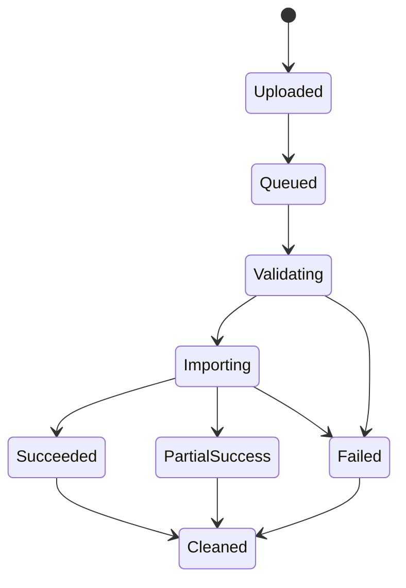
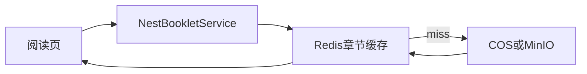

# 小册导入、文件存储与章节加载后端需求确认稿

> 状态：🟢 已确认；上传 API 和 FileAsset 字段以 Canonical 文档为准
> 最后更新：2026-08-02
> 适用：`apps/server` 的 File、Booklet、ImportJob、Storage 模块
> 关联：[内容、阅读、收藏与进度](./content-reading-domain-prd.md)、[远程阅读部署方案](../../deploy/personal-remote-reading.md)

---

## 1. 已确认的边界

| 项目             | 决策                                                                 |
| ---------------- | -------------------------------------------------------------------- |
| 生产对象存储     | 腾讯 COS 为唯一业务源数据                                            |
| 本地开发对象存储 | Docker Compose 启动 MinIO，模拟对象存储 API                          |
| Nest 存储访问    | 使用 `StorageProvider` 抽象，底层统一 AWS SDK v3 S3 Client/Presigner |
| 普通用户导入     | ZIP 上传后异步任务解析                                               |
| 现有本地小册迁移 | 仅管理员在受控目录运行 CLI 批量导入                                  |
| `meta.json`      | 可选；缺失时补全元数据，不以此拒绝合法章节文件                       |
| 导入小册可见性   | 强制作者/管理员私有；公开需管理员确认版权授权                        |

MinIO 是一个可通过 Docker 运行的 S3 风格对象存储服务。它以 Bucket / Object 组织文件，开发期让 Nest 使用与生产 COS 类似的上传、读取、签名 URL 能力；MinIO 数据保存在本地 Docker volume，生产不依赖它。

---

## 2. 存储抽象与对象布局

### 2.1 StorageProvider

业务层仅依赖以下能力：

```text
putObject(key, streamOrBuffer, metadata)
getObject(key)
headObject(key)
deleteObject(key)
createSignedDownloadUrl(key, expiresIn)
moveObject(fromKey, toKey)
```

环境实现：

| 环境 | Provider                      | Endpoint / 凭证                                                   |
| ---- | ----------------------------- | ----------------------------------------------------------------- |
| 本地 | S3 Provider（MinIO endpoint） | Compose 服务 `minio`，开发账号仅存 `.env.local`                   |
| 生产 | S3 Provider（COS endpoint）   | COS Bucket、Region、CAM 最小权限密钥，仅 `/etc/personal-hub/.env` |

不得让浏览器直接持有 COS / MinIO 永久密钥。需要下载时，Nest 先执行内容可见性和文件引用校验，再返回短期签名 URL 或通过 API 流式代理。

### 2.2 COS / MinIO 对象 Key

```text
booklets/{contentId}/
  manifest.json
  chapters/{chapterId}.md
  source/source.zip
  cover/{fileId}.webp

uploads/{yyyy}/{mm}/{fileId}/{sanitizedFileName}
  avatar/
  cover/
  content/
  temporary/
```

- 数据库保存对象 Key，不保存可变的长期公开 URL。
- `manifest.json` 保存章节索引，不保存所有章节正文。
- 原始 ZIP 与章节正文分开，下载源文件不影响按章阅读。
- 上传暂存对象以 `temporary/{uploadId}` 管理；完成或超时后移动/清理。

---

## 3. 文件资产与访问策略

### 3.1 FileAsset

`file_assets` 至少记录：

- `id`、`originalName`、`objectKey`、`mimeType`、`size`、`sha256`。
- `storageProvider`、`purpose`、`uploaderId`、`status`。
- `createdAt`、`deletedAt`、可选 `scanStatus`。

`purpose`：`AVATAR`、`COVER`、`CONTENT_FILE`、`BOOKLET_SOURCE`、`TEMPORARY_IMPORT`、`AI_ASSET`。

`status`：`UPLOADING`、`PENDING_VALIDATION`、`READY`、`FAILED`、`DELETED`。

### 3.2 通用上传

| 场景        | 首版策略                                                    |
| ----------- | ----------------------------------------------------------- |
| 头像 / 封面 | 预签名单 PUT 上传，完成时校验图像 MIME、大小与解码结果      |
| PDF / Word  | 小于等于 20 MiB 使用预签名单 PUT；超过阈值采用 S3 Multipart |
| 小册 ZIP    | 先上传为临时文件，异步任务接管                              |
| AI 资产     | 由 AI 模块写入，复用 FileAsset                              |

文件校验不可只信任扩展名或客户端 `Content-Type`：后端须限制文件大小、检测 MIME/魔数、清理文件名，并阻止路径穿越。

### 3.3 文件访问

- 访问内容主文件、封面、原始 ZIP 前，先定位关联 Content / Asset 并执行其可见性策略。
- `private` 内容和导入源 ZIP 仅作者/管理员可下载。
- 已删除、未完成上传或不再被引用的文件返回 404。
- 物理删除由异步清理任务执行；Content 软删除期间保留所有引用文件。

---

## 4. 小册 ZIP 导入

### 4.1 接受格式

```text
booklet.zip
├── meta.json                  # 可选
├── 001-introduction.md
├── 002-setup.md
└── ...
```

兼容子目录根包裹一层的 ZIP；解压后只能识别一个逻辑根目录。章节排序采用文件名自然排序，缺少数字前缀时按规范化文件名排序并在结果中给出告警。

`meta.json` 可包含 `title`、`author`、`summary`、`cover`、`categorySlug`、`tags`。缺失或解析失败不阻塞章节导入：

- 标题回退为 ZIP 文件名或由用户在导入页面填写。
- 作者为空时标记“待补充”。
- 分类、标签、摘要可在草稿编辑页补齐。
- JSON 格式错误记录为导入告警，不执行未受信任字段。

### 4.2 安全限制

初始默认阈值由配置服务管理，但不开放普通后台随意修改：

| 检查         | 默认值 / 规则                                  |
| ------------ | ---------------------------------------------- |
| ZIP 上传大小 | 最大 50 MB                                     |
| 解压后总大小 | 最大 500 MB                                    |
| 章节数量     | 最大 1,000                                     |
| 单章大小     | 最大 2 MB                                      |
| 压缩比       | 超过安全阈值拒绝，防 ZIP bomb                  |
| 路径         | 拒绝绝对路径、`..`、符号链接和非法编码         |
| 文件类型     | 仅 `meta.json`、封面允许白名单图像、章节 `.md` |
| Markdown     | 作为文本处理；渲染前净化 HTML                  |

导入器在独立临时目录处理，不直接解压到对象存储、应用代码目录或可公开访问目录。

### 4.3 异步任务状态机



`import_jobs` 字段：

- `id`、`requesterId`、`sourceFileId`、`status`、`progress`。
- `contentId`、`totalChapters`、`successCount`、`failureCount`。
- `warnings`、`failedItems`（受限长度）、`errorCode`、`errorMessage`。
- `idempotencyKey`、`createdAt`、`startedAt`、`finishedAt`、`expiresAt`。

流程：

1. 客户端上传 ZIP 到临时对象，得到 `sourceFileId`。
2. `POST /api/v1/app/booklet-imports` 创建 `booklet_import_jobs` 业务任务，校验权限与幂等键，投递 Redis 队列。
3. Worker 下载临时 ZIP 到隔离目录，安全校验、解析章节和元数据。
4. 每个有效章节写入 COS / MinIO；生成 `manifest.json`。
5. 在数据库事务中创建 `contents(type=booklet)`、`content_chapters`、源 ZIP FileAsset 引用与导入结果。
6. 默认创建 `DRAFT + PRIVATE` 小册，且写入 `importRestriction=PRIVATE_UNTIL_LICENSED`。
7. 成功后更新任务结果；失败时保留有限诊断信息，并按 TTL 清理临时对象。

任务不是 HTTP 请求生命周期的一部分。前端轮询状态或以后通过 SSE/WebSocket 接收进度；刷新页面后仍可查询结果。

### 4.4 任务 API

| 方法 | 路径                                              | 权限                     | 说明                           |
| ---- | ------------------------------------------------- | ------------------------ | ------------------------------ |
| POST | `/api/v1/app/uploads`                             | 登录                     | 创建预签名 ZIP 临时上传会话    |
| POST | `/api/v1/app/uploads/:uploadId/complete`          | 登录                     | 校验并登记临时 FileAsset       |
| POST | `/api/v1/app/booklet-imports`                     | `booklet:import` OWN/ALL | 创建异步导入任务               |
| GET  | `/api/v1/app/booklet-imports/:jobId`              | own / all                | 查询任务进度与结果             |
| POST | `/api/v1/app/booklet-imports/:jobId/retry`        | own / all                | 仅可重试失败任务，沿用原始 ZIP |
| GET  | `/api/v1/public/contents/:id/chapters`            | 由内容可见性决定         | 返回章节索引，不含 body        |
| GET  | `/api/v1/public/contents/:id/chapters/:chapterId` | 由内容可见性决定         | 仅返回单章正文和目录           |

章节列表返回 `BookletChapterSummary`，详情返回 `BookletChapterDetail`。禁止以任何公开接口批量返回全部章节正文。

---

## 5. 章节按需加载与缓存

### 5.1 读取顺序



- 章节元数据在 PostgreSQL 中索引；正文存对象存储。
- Redis 可缓存热点章节正文与 manifest；key 包含内容/章节 ID 和内容版本。
- `GET /chapters` 只读 PostgreSQL 索引；`GET /chapters/:chapterId` 缓存未命中时从对象存储读取正文。
- 章节更新、重新导入、删除、授权可见性变更时，主动清除对应 Redis key。
- 首版不加入服务器磁盘 LRU；COS 访问和 Redis 缓存先满足需求。若生产真实访问量证明有必要，再补第二级磁盘缓存，避免过早引入运维复杂度。

### 5.2 阅读进度

小册进度仍由 `reading_records` 保存 `contentId`、`chapterId`、`contentProgressPercent` 与 `chapterProgressPercent`，不存到对象存储。首版不存依赖视口的 `scrollPosition`；访问章节前必须先做内容可见性校验，防止通过已保存的 `chapterId` 绕过私有小册。

---

## 6. 管理员 CLI：迁移现有 content-local

### 6.1 边界

现有约 71 本本地小册不通过用户网页逐本上传，也不让服务器 Nest 扫描任意挂载目录。使用受控管理员 CLI：

```text
pnpm booklet:import-local --source /absolute/content-local --dry-run
pnpm booklet:import-local --source /absolute/content-local --execute
```

CLI 仅在管理员开发机运行：

1. 扫描本地受控目录，不接受不可信 Web 请求路径。
2. 使用与 ZIP 导入相同的解析、校验、manifest 和 StorageProvider 逻辑。
3. 直接写 COS 与受控 API / 数据库迁移入口。
4. 输出每册的成功、告警、失败与可重跑清单。
5. 使用稳定源目录指纹和幂等键，重复运行不创建重复内容。

### 6.2 迁移规则

- 默认导入为 `draft + private`，导入人设为管理员或 CLI 参数指定的归属用户。
- `meta.json` 缺失不阻塞，输出待补充元数据报告。
- 不自动把目录中的图片、远程 URL 或未知附件推送到 COS；首版保留外链并记录告警。
- CLI `--dry-run` 必须在实际上传前显示计划变更。
- 迁移结果写入 `import_jobs` 或专用 `migration_runs`，以便追踪和重跑。

---

## 7. 本地与生产部署要求

### 7.1 本地 Compose

本地 `compose.dev.yml` 启动：

- PostgreSQL：内容元数据、任务、文件资产。
- Redis：会话缓存、限流、BullMQ 导入队列、章节缓存。
- MinIO：Bucket 与对象存储开发模拟。

Nest 在宿主机热更新，通过 `.env.local` 连接 `localhost` 端口。MinIO 初始化 Bucket 使用一次性 init job 或受控启动脚本，不使用人工控制台作为唯一配置来源。

### 7.2 生产

- COS Bucket 为私有读写，CAM 账号使用最小权限。
- `apps/server` 容器通过 `/etc/personal-hub/.env` 读取 COS 凭据。
- PostgreSQL、Redis、server 由生产 Compose 编排；Nginx 只反向代理 API。
- 上传临时目录、任务日志和对象存储凭据不进入 Git。
- COS 生命周期规则可对已删除的临时 ZIP 与过期导入源文件单独配置；数据库备份不写入 COS，遵循部署策略中的本地备份与云盘快照规则。

---

## 8. 编码验收条件

- 本地 MinIO 与生产 COS 可通过同一 `StorageProvider` 运行基本上传、读取、删除和签名下载测试。
- ZIP 导入在异步 Worker 中执行；重复提交可由幂等键安全返回已有任务。
- ZIP bomb、路径穿越、未知文件与超限章节可被明确拒绝并安全清理。
- 章节列表不含正文；阅读页仅在请求单章时获取对应 body。
- 任务失败可查看受限失败项并重试；临时对象最终会清理。
- CLI 支持 dry-run、幂等批量迁移和结构化结果，不会将本地小册默认公开。

## 9. 模块实施前契约清单

- OpenAPI/DTO：上传会话、完成校验、导入任务、章节摘要/详情和轮询错误响应必须生成到 OpenAPI；浏览器只得到预签名 URL，不得到永久凭证。
- 枚举与错误：统一 FileAsset/任务 `UPPER_SNAKE_CASE` 状态，覆盖 `FILE_*`、`UPLOAD_*`、`BOOKLET_IMPORT_*` 错误码。
- 权限与审计：`booklet:import` 的 OWN/ALL 范围、导入限制解除的 `content:publish + ALL`、授权说明和 `audit_logs` 写入路径必须同时测试。
- 存储与队列：验证 `StorageProvider`、对象键、ZIP 安全阈值、Outbox 投递、独立 Worker 重试与临时对象清理。
- 前端迁移：React mock 只能通过 Adapter 对接 `/api/v1/app/uploads` 与 `/api/v1/app/booklet-imports`，不得保留扫描服务器目录的 HTTP 接口。
