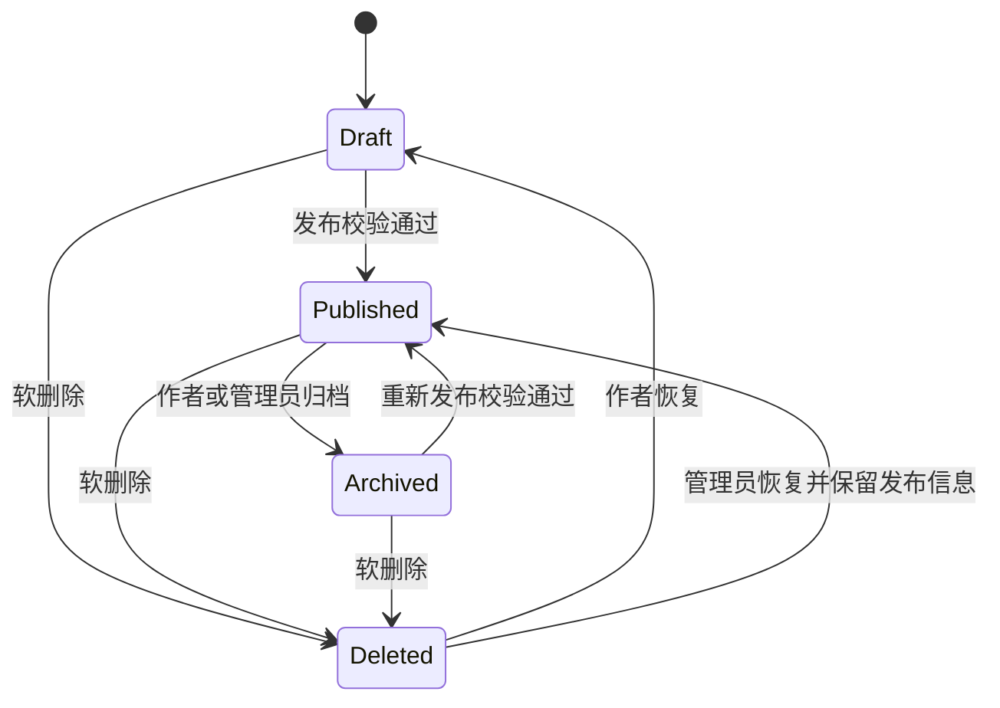

# 内容、阅读、收藏与进度后端需求确认稿

> 状态：🟢 已确认；路径与 DTO 以 Canonical API/数据模型为准
> 最后更新：2026-08-02
> 适用：`apps/server` 的 Content、Category、Tag、Favorite、Reading 模块
> 关联：[文档内容与创作工具体系](../../product/content-system.md)、[公开前台](../../product/frontend-public.md)、[工作区](../../product/workspace.md)、[Auth、会话与 RBAC](./auth-rbac-session-prd.md)

---

## 1. 目标与领域边界

内容域统一管理可阅读的知识资源：Markdown、富文本、小册、PDF、Word、外链和项目。阅读、收藏、进度恢复属于内容域；编辑器 UI、ZIP 导入协议、对象存储和 AI 生成分别由后续模块深化。

首版必须完成：

- 公开内容列表、筛选、详情、精选、项目展示。
- 工作区内容创建、编辑、保存草稿、发布、归档、软删除与恢复。
- 分类树、标签、多类型内容元数据。
- 收藏、阅读历史、阅读进度和工作区“继续阅读”。
- PostgreSQL 全文检索的基础实现。
- 发布前手动快照，作为首版最小可恢复版本。

---

## 2. 内容模型与状态机

### 2.1 内容主模型

`contents` 是统一主表；不同类型的专属字段放关联表或 `extraMeta`，不为每个格式拆一张独立主表。

| 字段                                | 规则                                                                       |
| ----------------------------------- | -------------------------------------------------------------------------- |
| `id`                                | 不可变唯一 ID                                                              |
| `type`                              | `MARKDOWN` / `RICH_TEXT` / `BOOKLET` / `PDF` / `WORD` / `LINK` / `PROJECT` |
| `title`                             | 草稿可为空或临时标题；发布必须 1～200 字                                   |
| `summary`                           | 可选；发布时为空则从正文提取前 200 字                                      |
| `categoryId`                        | 草稿可为空；发布必须关联一个有效分类                                       |
| `authorId`                          | 由当前登录用户在服务端写入，客户端不可指定                                 |
| `status`                            | `DRAFT` / `PUBLISHED` / `ARCHIVED`                                         |
| `visibility`                        | `PUBLIC` / `LOGIN` / `PRIVATE`                                             |
| `sourceType`                        | `MANUAL` / `UPLOAD` / `IMPORT`                                             |
| `markdownSource` / `editorDocument` | Markdown 原文或富文本编辑器 JSON；分别映射 `content_bodies`                |
| `renderedHtml` / `toc`              | 服务端派生字段；富文本 JSON 保存/发布后生成净化 HTML                       |
| `primaryFileId`                     | PDF、Word 等主文件引用                                                     |
| `coverFileId`                       | 封面文件引用，替代直接信任 URL                                             |
| `externalUrl`                       | link / project 的外部地址，必须做 URL 校验                                 |
| `isFeatured`                        | 仅管理员可修改                                                             |
| `publishedAt`                       | 首次发布时写入；重新发布默认不重置                                         |
| `deletedAt` / `deletedBy`           | 软删除标记                                                                 |
| `version`                           | 每次更新递增；首版后写覆盖，未来启用客户端乐观锁时再要求 PATCH 传入        |

### 2.2 三个相互独立的维度

| 维度     | 值                                 | 含义                             |
| -------- | ---------------------------------- | -------------------------------- |
| 生命周期 | `DRAFT` / `PUBLISHED` / `ARCHIVED` | 内容是否处于可发布状态           |
| 可见性   | `PUBLIC` / `LOGIN` / `PRIVATE`     | 已发布内容的访问对象             |
| 来源     | `MANUAL` / `UPLOAD` / `IMPORT`     | 内容由编辑器、文件上传或导入产生 |

不得用 `visibility` 替代发布状态，也不得依据 `sourceType` 推断访问权限。

### 2.3 状态转换

发布校验：

- 标题、分类、可见性必须有效。
- Markdown / 富文本必须有非空正文。
- PDF / Word 必须关联已完成、可访问的主文件。
- link / project 必须有合法外链；project 还需满足项目专属字段校验。
- booklet 必须已完成章节导入，详见后续小册 PRD。

---

## 3. 访问控制与版权边界

### 3.1 内容可见性

| 状态与可见性          | 访客           | 登录用户 | 作者       | 管理员       |
| --------------------- | -------------- | -------- | ---------- | ------------ |
| `published + public`  | 可读           | 可读     | 可读       | 可读         |
| `published + login`   | 401 / 登录引导 | 可读     | 可读       | 可读         |
| `published + private` | 不可见         | 不可见   | 可读       | 可读         |
| `draft` / `archived`  | 不可见         | 不可见   | 工作区可见 | 可读         |
| `deleted`             | 不可见         | 不可见   | 回收站可见 | 管理页可管理 |

所有列表、详情、章节、文件下载和搜索接口必须复用同一访问策略。不能只保护详情而在搜索结果泄露标题或摘要。

### 3.2 导入小册的特殊规则

`sourceType=IMPORT` 且 `type=BOOKLET` 的内容首版强制 `PRIVATE_UNTIL_LICENSED + PRIVATE`：

- 仅导入作者和管理员可阅读、下载和管理。
- 普通编辑者、其他登录用户与访客不能因 `published` 状态而访问。
- 若管理员确认拥有公开传播授权，可执行“解除导入限制”操作，并留下授权说明、操作人和审计日志；之后才允许选择 `login` / `public`。
- 这是内容合规规则，不应仅由前端隐藏实现。

---

## 4. 分类、标签与精选

### 4.1 分类

- 使用无限层级邻接表；移动分类时服务端必须禁止循环引用，排序只在同父节点内生效。
- 分类由管理员管理；删除前检查是否存在子分类或已关联内容。
- 草稿可无分类；发布时必须选择一个未禁用分类。
- 分类移动、删除、禁用需写审计日志。

### 4.2 标签

- 平铺、多对多；名称和 slug 大小写不敏感唯一。
- editor 及以上可在内容编辑时创建新标签；同名时复用已有标签。
- 管理员可合并、删除标签；删除前需要说明如何处理关联内容。
- 内容列表支持多标签 AND 筛选，公开接口使用逗号分隔的 `tagSlugs`；后台内部若使用 UUID 仅限 DTO 内部字段，不暴露为公开查询参数。

### 4.3 精选

- `isFeatured` 只允许具备 `content:featured` 且数据范围为 `ALL` 的管理员修改。
- 首页优先展示精选内容；没有精选时再按发布时间返回最新发布内容。
- 精选不绕过可见性：访客首页只看 `public`，登录用户可按其权限看更多。

---

## 5. 工作区写入与版本

### 5.1 数据范围

| 操作                 | 作者                | 管理员 |
| -------------------- | ------------------- | ------ |
| 查看草稿/归档/回收站 | own                 | all    |
| 编辑正文与元信息     | own                 | all    |
| 发布 / 归档          | own（具备发布权限） | all    |
| 设置精选             | 不可                | all    |
| 软删除与恢复         | own                 | all    |
| 永久删除             | 不可                | all    |

后端从 JWT 获取用户 ID，任何 `authorId`、`deletedBy`、审核人字段都不能相信客户端提交。

### 5.2 并发与手动快照

- 首版更新采用后写覆盖，但内容表维护递增 `version`；后续多人协作需求出现时，PATCH 再要求携带 version 并在不一致时返回 `409 CONTENT_VERSION_CONFLICT`。
- 保存草稿仅更新当前正文和元信息，不为每次输入创建历史。
- 发布前自动创建一个 `content_versions` 快照，保存原文、派生 HTML/目录、操作者与原因 `publish_snapshot`。
- 管理员/作者未来可从快照恢复；首版不做逐行 diff、自动定时快照或多人协同编辑。
- Word / 富文本后续若接入协作编辑，需要独立版本/操作日志策略，不能直接依赖本期快照。

### 5.3 软删除与文件清理

- 用户删除后内容进入回收站，保留 30 天；作者可恢复。
- 删除只设置 `deletedAt`，不立即删除正文、章节和文件。
- 到期由定时任务标记为可永久清理；管理员也可永久删除。
- 永久删除在事务中解除内容、标签、收藏、进度、章节等关联；文件由异步清理任务判断是否仍被其它资源引用后再物理删除。

---

## 6. 阅读、收藏与进度

### 6.1 收藏

| 方法   | 路径                               | 语义                                     |
| ------ | ---------------------------------- | ---------------------------------------- |
| GET    | `/api/v1/app/favorites`            | 当前用户收藏列表，支持类型、关键词和分页 |
| PUT    | `/api/v1/app/favorites/:contentId` | 幂等创建收藏                             |
| DELETE | `/api/v1/app/favorites/:contentId` | 幂等取消收藏                             |

收藏前先校验内容对当前用户可见。`favorites` 对 `(userId, contentId)` 建唯一索引。

### 6.2 阅读历史与进度

- 登录用户打开可读内容详情时，以节流方式 upsert `reading_records` 的 `lastReadAt`。
- 保存 `contentProgressPercent`；小册额外保存 `chapterId + chapterProgressPercent`，从而恢复章节及章节内进度。首版不依赖易受视口影响的像素 scrollPosition。
- 位置更新使用节流（例如滚动停止或间隔 10 秒），避免每次滚动请求。
- 记录目标内容变为不可见、删除或章节已不存在时，读取接口返回空记录而不是泄露资源信息。
- 最近阅读按 `lastReadAt DESC` 返回，默认最多 5 条；工作区 Dashboard 复用该聚合结果。

### 6.3 阅读计数

- `readCount` 用于排序和运营展示，不作为精确分析数据。
- 对公开内容可在详情读取时异步去重计数；按匿名访客短期标识或用户 ID 限制重复增长。
- 高并发下使用 Redis 聚合后批量回写 PostgreSQL，首版流量较低时可先直接原子增量。

---

## 7. 搜索与列表

### 7.1 公开内容查询

`GET /api/v1/public/contents` 支持：

- `keyword`：标题、摘要与首版受限正文的 PostgreSQL 全文搜索。
- `categorySlug`：公开分类筛选。
- `tagSlugs`：多标签 AND 筛选。
- `types`：内容类型列表。
- `sort`：`LATEST` / `POPULAR`。
- `page`、`pageSize`：统一分页。实现默认以 Canonical 为准（`page=1&pageSize=10`，最大 100）；本节历史草案中的 20 不再作为实现依据。

查询必须在 SQL 层添加可见性条件，不能先查全量再由 Node 内存过滤。

### 7.2 详情与阅读

| 方法   | 路径                               | 说明                                               |
| ------ | ---------------------------------- | -------------------------------------------------- |
| GET    | `/api/v1/public/contents/:id`      | 返回元信息和当前类型所需详情；访问策略在服务端执行 |
| GET    | `/api/v1/public/contents/featured` | 当前请求者可见的精选内容                           |
| GET    | `/api/v1/public/contents/meta`     | 公开分类/标签聚合，用于筛选器                      |
| GET    | `/api/v1/app/contents`             | 当前用户自己的内容，包含草稿、归档和可选回收站     |
| POST   | `/api/v1/app/contents`             | 创建草稿或提交可发布内容                           |
| PATCH  | `/api/v1/app/contents/:id`         | 更新元信息/正文                                    |
| POST   | `/api/v1/app/contents/:id/publish` | 执行发布校验、创建快照和状态转换                   |
| POST   | `/api/v1/app/contents/:id/archive` | 归档                                               |
| DELETE | `/api/v1/app/contents/:id`         | 软删除                                             |
| POST   | `/api/v1/app/contents/:id/restore` | 从回收站恢复                                       |

小册章节、文件上传、分块上传与导入结果接口不在本文件定义，将在后续 PRD 细化。

---

## 8. 安全与审计

- Markdown 渲染必须净化 HTML；富文本存储和展示同样必须遵循白名单净化。
- 外链与项目链接只允许 `https:`，开发环境可白名单 localhost；禁止开放重定向。
- 内容正文、摘要、文件名限制长度；搜索关键词限制长度并使用参数化查询。
- 发布、归档、永久删除、精选变更、导入限制解除都记录 `audit_logs`。
- 访问私有内容、下载导入源文件等失败时统一返回 404 或无权限策略，避免枚举私有资源。

---

## 9. 进入编码的验收条件

- 所有内容列表、详情、搜索、收藏、进度和文件访问使用统一可见性策略。
- 草稿、发布、归档、软删除/恢复的状态转换与权限有自动化测试。
- 发布前校验分类、标题、正文/文件；草稿允许不完整元数据。
- 导入小册无法被意外公开；解除限制需要管理员明确操作与审计。
- 更新冲突能返回 409，发布前自动产生手动快照。
- 收藏与阅读进度具备唯一约束和幂等/节流策略。

待后续小册与文件模块确认：

- ZIP 导入格式、大小限制、异步任务状态和重复导入策略。
- 本地卷与 MinIO 的抽象、文件访问签名/代理和分块上传协议。
- PDF/Word 的转换、预览和版本策略。

## 10. 模块实施前契约清单

开始 Content 领域编码前必须在同一 PR/设计评审中确认：

- OpenAPI/DTO：内容各类型互斥字段、公开/工作区/后台详情视图、回收站过滤和分页响应。
- 枚举与错误：本文 `UPPER_SNAKE_CASE` 枚举，以及 `CONTENT_*`、`CATEGORY_*`、`TAG_*` 错误码。
- 权限：Controller 的动作权限和 Service 的 `OWN/ALL` 查询条件；精选固定为 `content:featured + ALL`。
- 数据库：`contents.search_document` 的 `tsvector` 生成方式、GIN 索引、可见性 SQL 条件与迁移回滚演练。
- 测试与迁移：状态机、私有资源 404、标签 AND、回收站、全文检索和 React Mock 适配的 HTTP E2E。
