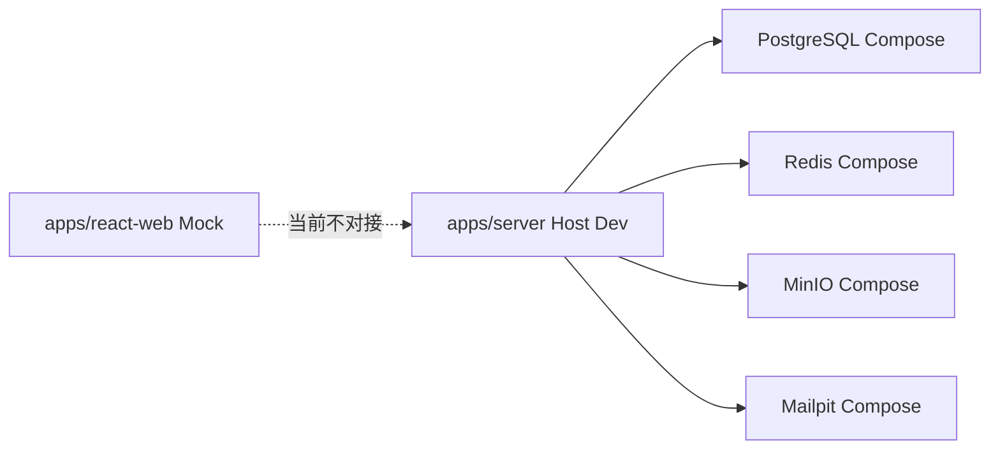

# Nest Server 脚手架 PRD

> 状态：🟢 已确认；下一阶段 `apps/server` 工程骨架的唯一 Build 依据
> 最后更新：2026-08-02
> 优先级：P0
> 关联：[后端实现约定](../../backend/conventions.md)、[Canonical API](../../backend/canonical-api.md)、[Canonical 数据模型](../../backend/canonical-data-model.md)、[依赖目录](../../engineering/nest-dependency-catalog.md)、[Compose 策略](../../deploy/nest-compose-strategy.md)

---

## 1. 目标与非目标

本阶段只创建可长期演进的 NestJS 运行底座，让后续 Auth、Content、File、AI 等领域模块有一致的目录、配置、数据库、缓存、日志、健康检查和测试入口。

完成后必须具备：

- `apps/server` 可独立开发、类型检查、构建和启动。
- 本地 Compose 可启动 PostgreSQL、Redis、MinIO、Mailpit；Nest 运行在宿主机热更新。
- Prisma 可连接本地 PostgreSQL，并通过 migration 管理 Schema。
- `/api/v1`、统一异常响应、Swagger、liveness/readiness、结构化日志和 Redis 连接均可验证。

本阶段明确不包含：

- Auth、RBAC、用户、内容、文件、小册、AI 等业务端点和真实业务 Schema。
- 真实 AI 厂商、腾讯 COS 凭证、生产域名、Nginx 配置和生产发布。
- React 服务层切换、Next.js 工程、Flutter、数据库 seed 的完整业务权限目录。

## 2. 权威边界

| 事项                                        | 唯一来源                                                    |
| ------------------------------------------- | ----------------------------------------------------------- |
| HTTP 前缀、响应、错误、分页与端点分区       | [Canonical API](../../backend/canonical-api.md)             |
| 表命名、UUID、Prisma 映射和数据约束         | [Canonical 数据模型](../../backend/canonical-data-model.md) |
| Nest 分层、Redis/队列、日志、测试和安全规则 | [后端实现约定](../../backend/conventions.md)                |
| 包选型与不可混用约束                        | [依赖目录](../../engineering/nest-dependency-catalog.md)    |
| 本地/生产 Compose、存储和发布原则           | [Compose 策略](../../deploy/nest-compose-strategy.md)       |

不得参考已降级的 `apps/api`、`/api/*`、`200 + code`、bcrypt、Passport 或生产 MinIO 方案创建本工程。

## 3. 目标目录

```text
apps/server/
├── src/
│   ├── common/                 # Filter、Guard、Interceptor、Decorator、共享类型
│   ├── config/                 # Zod 环境变量校验
│   ├── infrastructure/         # Prisma、Redis、日志等基础设施实现
│   ├── modules/
│   │   └── health/             # 首个可验证模块
│   ├── app.module.ts
│   └── main.ts
├── prisma/
│   └── schema.prisma
├── test/
├── .env.example
├── package.json
├── tsconfig.json
├── nest-cli.json
└── AGENT.md
```

- 后端应用固定为 `apps/server`，不得新建 `apps/api`。
- Prisma 固定在 `apps/server/prisma`；首版不建立 `packages/database`。
- `packages/shared-types` 仅保留跨端领域常量和类型；HTTP DTO、OpenAPI 和运行时校验由 `apps/server` 负责。
- 复杂业务模块后续按 `controller → service → repository → provider` 的领域垂直结构扩展，不能在脚手架阶段预建空业务模块。

## 4. 本地运行架构



| 文件/服务         | 规则                                                             |
| ----------------- | ---------------------------------------------------------------- |
| `compose.dev.yml` | 只编排 PostgreSQL 16、Redis 7、MinIO、MinIO init job、Mailpit    |
| `apps/server`     | 宿主机通过 `pnpm --filter server dev` 热更新，不放入本地 Compose |
| `.env.local`      | 本地机器私有，不提交；使用映射后的 `localhost` 端口              |
| `.env.example`    | 只列变量名、格式、是否必填和安全说明，不含真实密钥               |
| 自动化测试        | 使用 Testcontainers 临时 PostgreSQL/Redis，禁止复用开发卷        |

生产环境将由单独实施计划落实：Nginx、Nest、PostgreSQL、Redis 使用 Compose，COS 是唯一业务对象存储；本阶段不创建生产 Compose。

## 5. 首批基础能力与验收

| 能力       | 本阶段要求                                                 | 验收方式                             |
| ---------- | ---------------------------------------------------------- | ------------------------------------ |
| HTTP       | Fastify、全局 `/api/v1` 前缀、ValidationPipe、统一异常格式 | 非法 DTO 返回 `{ error, requestId }` |
| OpenAPI    | `@nestjs/swagger` 从 DTO/Controller 生成                   | 开发环境可打开 Swagger               |
| 配置       | `@nestjs/config + Zod`；缺失必填变量阻止启动               | 移除必填变量后启动失败               |
| PostgreSQL | PrismaClient 生命周期管理；空 Schema 可迁移                | 本地 migration 成功                  |
| Redis      | `ioredis` 统一服务与启动连接检查                           | readiness 能识别 Redis 不可用        |
| 健康检查   | Terminus liveness/readiness                                | DB、Redis 状态进入 readiness         |
| 日志       | `nestjs-pino` JSON 与 requestId                            | 日志不输出敏感环境变量               |
| 质量       | ESLint、Prettier、Vitest、`tsc --noEmit`、SWC 构建         | 根脚本或 server 脚本全部通过         |

首版健康路由仅用于基础设施验证；业务健康和权限端点在领域模块开发时补充。

## 6. 依赖和脚本

精确版本在创建当天根据 Node 22、Nest 11 和 Fastify 实际兼容性由包管理器锁定，包名与职责必须遵守依赖目录。

`apps/server/package.json` 至少提供：

```text
dev        # Nest 开发热更新
build      # Nest CLI + SWC 构建
start      # 启动构建产物
lint       # ESLint
typecheck  # tsc --noEmit
test       # Vitest
prisma:*   # generate / migrate / studio 等明确子命令
```

根 `package.json` 在脚手架完成时补充 `dev:server`、`build:server`、`lint:server`、`typecheck:server`、`test:server`；原 React 脚本保持不变。

## 7. 实施顺序

1. 创建 `apps/server`、独立 TypeScript/Nest 配置和依赖清单。
2. 创建 `compose.dev.yml`、环境模板及本地基础设施连接配置。
3. 接入 Config、Pino、Prisma、Redis、Terminus、全局异常和 Swagger。
4. 初始化 Prisma Schema 和首个 migration；只包含基础所需模型，不抢先实现业务领域。
5. 补齐脚本、README/AGENT、单元与基础 HTTP 验收。
6. 验收后才进入 Auth → System/Menu → Content → File/Booklet → AI → Admin 的领域实施顺序。

## 8. 完成标准

- `docker compose -f compose.dev.yml up -d` 成功启动四类本地依赖。
- `pnpm --filter server dev` 能启动，且 `/api/v1` 下健康与 Swagger 路由可访问。
- Prisma migration、Redis readiness、格式检查、类型检查、测试和生产构建均通过。
- 本地环境不需要真实 COS、SMTP、AI Key；Fake Provider 与 Mailpit 不泄露到生产配置。
- 工程目录、脚本、环境变量、Compose 文件与本 PRD不一致时，必须先更新本 PRD及关联实施文档，再继续业务开发。
