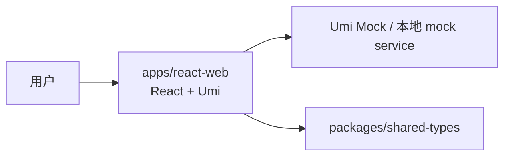
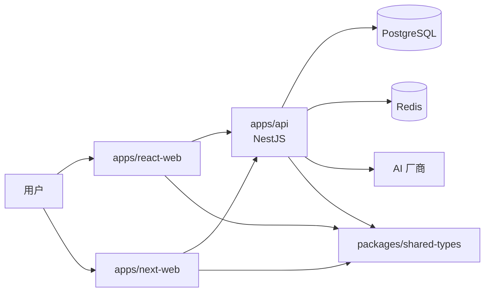

# React-first 工程架构

> 状态：✅ React-first 当前架构已落地；后端与 Next.js 部分为后续边界
> 最后更新：2026-06-27
> 目标：定义 React-first 阶段的 Monorepo 结构、应用边界、共享包和未来与 NestJS / Next.js 的协作关系。

---

## 1. 总体结构

```txt
personal-hub/
├── apps/
│   ├── react-web/          ← React + Umi + Ant Design Pro 首版 Web
│   ├── next-web/           ← 后续 Next.js 15 公开前台 / 内容页重构
│   └── api/                ← 后续 NestJS 统一后端 API
├── packages/
│   ├── shared-types/       ← 共享类型、枚举、接口响应结构、Zod Schema
│   ├── api-client/         ← 后续可选：统一请求 SDK
│   ├── config/             ← 后续可选：主题 token、权限点、菜单常量
│   └── mock-data/          ← 后续可选：跨应用复用 mock 数据
├── docs/
├── study/
├── package.json
├── pnpm-workspace.yaml
├── turbo.json
└── tsconfig.base.json
```

首版可以只创建：

- `apps/react-web`
- `packages/shared-types`
- 根目录 Monorepo 配置

`apps/next-web` 和 `apps/api` 可以后续按阶段创建，但目录命名和共享边界先在文档中固定。

---

## 2. 应用职责边界

| 应用 | 阶段 | 职责 |
|---|---|---|
| `apps/react-web` | 立即开始 | 用 React/Umi/Ant Design Pro 完成首版全量 Web 功能 |
| `apps/next-web` | 后续 | 承担 SEO 友好的公开前台、内容列表、内容阅读、项目页、关于页 |
| `apps/api` | 后续 | NestJS 统一 API，承载认证、内容、AI、系统配置、后台管理能力 |

---

## 3. React-first 阶段请求链路



说明：

- 页面不直接写死数据。
- 页面调用 service 层。
- service 层当前请求 mock，未来切到真实 API。
- mock 响应结构尽量贴近后续 NestJS API。

---

## 4. 后端接入后的请求链路



说明：

- React 和 Next 共用同一套 NestJS API。
- Flutter 后续也接同一套 API。
- 前端不会直接访问数据库、Redis 或 AI 厂商。

---

## 5. 共享包规划

### 5.1 `packages/shared-types`

首版必须创建。

建议结构：

```txt
packages/shared-types/
├── package.json
├── tsconfig.json
└── src/
    ├── index.ts
    ├── common.ts
    ├── auth.ts
    ├── user.ts
    ├── permission.ts
    ├── content.ts
    ├── ai.ts
    ├── system.ts
    └── pagination.ts
```

建议首批沉淀：

- `ApiResponse<T>`
- `PaginationQuery`
- `PaginationResult<T>`
- `ContentType`
- `ContentStatus`
- `ContentVisibility`
- `UserRole`
- `PermissionCode`
- `ThemeMode`
- `NavigationPosition`
- `AiToolType`
- `AiSession`
- `SystemConfig`

### 5.2 `packages/api-client`

后续可选，不必首版强行创建。

适合在真实 NestJS API 开始稳定后创建，用来放：

- axios/fetch 封装。
- 模块级请求函数。
- OpenAPI 生成客户端。
- 统一错误处理类型。

### 5.3 `packages/config`

后续可选。

适合放跨应用共享的静态配置：

- 权限点清单。
- 菜单 key。
- 主题 token。
- 路由常量。
- 默认系统配置。

### 5.4 `packages/mock-data`

后续可选。

如果 React 和 Next 同时需要 mock，可把 mock 数据从 `apps/react-web` 抽出来，避免两边重复。

---

## 6. 工程脚本建议

根目录脚本：

```json
{
  "scripts": {
    "dev": "turbo dev",
    "dev:react": "pnpm --filter react-web dev",
    "build": "turbo build",
    "build:react": "pnpm --filter react-web build",
    "lint": "turbo lint",
    "typecheck": "turbo typecheck",
    "format": "prettier --write ."
  }
}
```

首版验收重点：

- `pnpm install` 能完成依赖安装。
- `pnpm dev:react` 能启动 React 工程。
- `apps/react-web` 能引用 `packages/shared-types`。
- mock 接口能返回统一响应结构。

---

## 7. 目录级 AGENT 规则

React-first 工程创建后建议补：

- `apps/react-web/AGENT.md`
- `packages/shared-types/AGENT.md`

如果后续创建 Next 和 API，再补：

- `apps/next-web/AGENT.md`
- `apps/api/AGENT.md`

`apps/react-web/AGENT.md` 至少说明：

- 这是 React-first 首版实现，不是最终替代 Next.js。
- 页面数据必须通过 service / mock 层获取。
- 公共类型优先放到 `packages/shared-types`。
- 后台和工作区优先使用 Ant Design / Pro Components。
- 公开前台允许做轻量品牌化样式，但不要另起完全孤立的设计系统。
